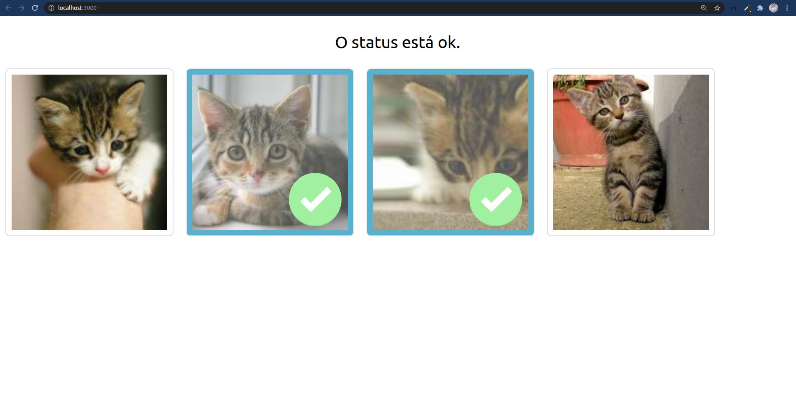

# react-flask-app

Aplicação utilizando React e Flask. Basicamente a aplicação recebe um status "ok" da api (um script em Python) que libera o frontend (em React.js) exibir as imagens que estão salvas na pasta "images". As imagens exibidas são clicáveis, permitindo uma seleção delas.



Baseado no tutorial:
https://blog.miguelgrinberg.com/post/how-to-create-a-react--flask-project


Para usa-lo:

Clonar o repositório:
```sh
git clone https://github.com/andreocunha/react-flask-app.git
```

Navegar até a aplicação:
```sh
cd react-flask-app
```

Baixar as dependências do React:
```sh
npm install
```

Instalar o Flask no computador:
```
pip install Flask
```

Executar a api com o script python primeiro, portanto abra um outro terminal e navegue até a pasta api:
```sh
cd api
```
Depois execute:
```sh
flask run
```

E por fim, na pasta principal execute:
```sh
npm start
```
